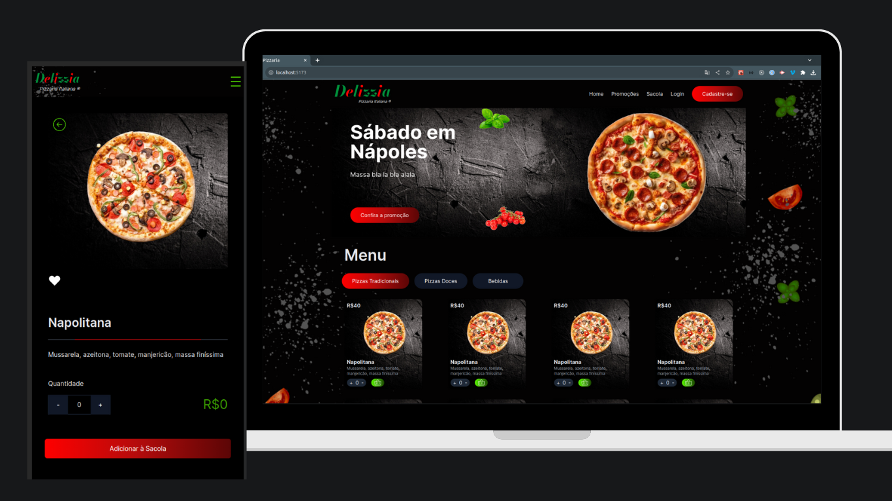

# Delizzia Pizzaria

## Projeto desenvolvido para entrega de atividade  do curso full stack iTalents - módulo :Roteamento.
 Trata-se de uma e-commerce de pizzaria, com a finalidade de venda online de produtos.
 O layout do projeto foi inspirado em alguns designes disponíveis Pinterest e a partir dessas inspirações alguns elementos foram criados de maneira personalizada, como o Background que foi totalmente desenvolvido no Canvas.

  ### Requisitos para entrega:
    * Mínimo 4 páginas
    * Envio de dados via rotas de parâmetros
    * Página 404 para rotas não encontradas
    * Estilização de todos os componentes

## Tecnologia
- Vite
- React
- TypeScript
- React-router-dom
- Tailwind css
- Swiper (Slide dos produtos)

